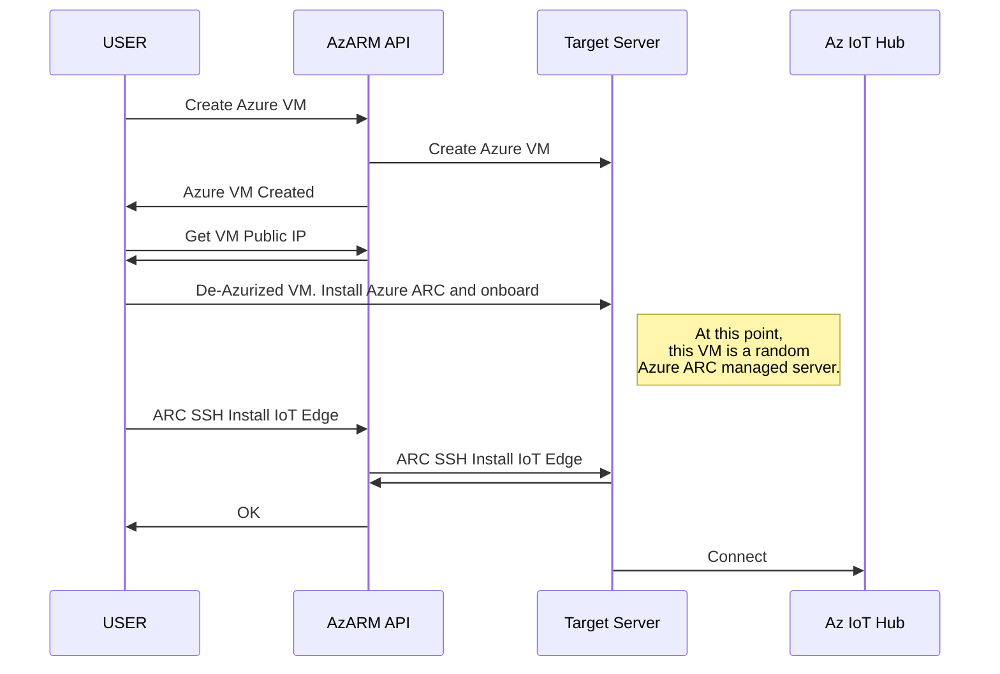

# Install Azure IoT Edge using Azure ARC-enabled servers
### Overview ###
The purpose is to leverage the capabilities of [Azure ARC-enabled Servers](https://docs.microsoft.com/en-us/azure/azure-arc/servers/overview) to install arbitrary software in a remote machine. In this case the [Azure IoT Edge](https://docs.microsoft.com/en-us/azure/iot-edge/iot-edge-runtime?view=iotedge-1.4) runtime.

For simplicity, we are going to use an Azure VM that will be "de-Azurized", i.e., remove the control agents and block the control endpoints on which Azure Compute relies in order to manage it. Then we will onboard this VM  as an Azure ARC-enabled server. 
I will devide the process on 3 distinct scripts:

 - [1_create_az_arc_iaas.sh](https://github.com/SeryioGonzalez/install_iot_edge_with_arc_for_servers/blob/main/1_create_az_arc_iaas.sh "1_create_az_arc_iaas.sh")
 - [2_install_arc_on_vm.sh](https://github.com/SeryioGonzalez/install_iot_edge_with_arc_for_servers/blob/main/2_install_arc_on_vm.sh "2_install_arc_on_vm.sh")
 - [3_install_iot_edge_via_arc_for_servers.sh](https://github.com/SeryioGonzalez/install_iot_edge_with_arc_for_servers/blob/main/3_install_iot_edge_via_arc_for_servers.sh "3_install_iot_edge_via_arc_for_servers.sh")

The first script will create a regular Azure VM. It will reconfigure SSH port to a preconfigured variable other than 22 in order to avoid collisions with certain enterprise [Azure Policies](https://docs.microsoft.com/en-us/azure/governance/policy/overview).
The second script will "de-Azurized" the VM and install Azure ARC-enabled Server agents and connect the agent as an Azure ARC-enabled Server.
The last script will install Azure IoT Edge purely using Azure Arc-enabled server capabilities

### Requirements
- **Azure Subscription**
- **Environment variables** with sensitive data should be created. I usually configure them in the .bashrc start-up script:
	- subscription_id
	- tenant_id
	- public_key_file
	- private_key_file
		
- **Service Principal** with role Contributor in the scope of the RG used in this demo. More granular roles should be used in production environments. Store the principal information in a file named **.az_arc_onboarding_principal.json** with the following content in the project root:
```
			{
			  "appId": "YOUR_PRINCIPAL_APP_ID",
			  "password": "YOUR_PRINCIPAL_PASSWORD"
			}
```
### Flow

